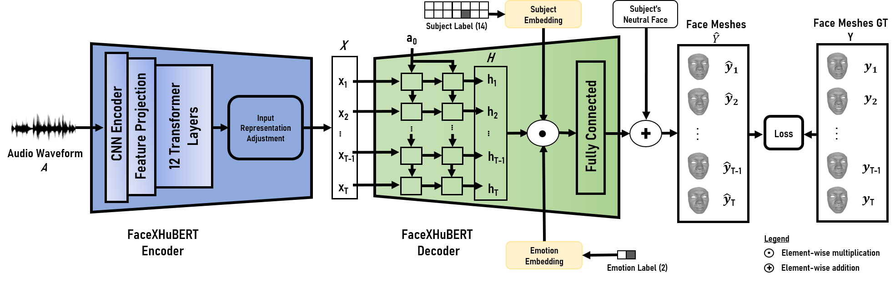

# FaceXHuBERT (ICMI '23)
### Code repository for the paper: 

>_FaceXHuBERT: Text-less Speech-driven E(X)pressive 3D Facial Animation Synthesis using Self-Supervised Speech Representation Learning_.

> Authors: Kazi Injamamul Haque, Zerrin Yumak

> [[Paper]](https://dl.acm.org/doi/pdf/10.1145/3577190.3614157) [[Project Page]](https://galib360.github.io/FaceXHuBERT/) [[Video]](https://www.youtube.com/watch?v=AkBhnNOxwE4&ab_channel=KaziInjamamulHaque)


> This GitHub repository contains PyTorch implementation of the work presented in the paper mentioned above. Given a raw audio, FaceXHuBERT generates and renders expressive 3D facial animation. We recommend visiting the project website and watching the supplementary video.

<p align="center">

</p>

## Environment

- Windows (tested on Windows 10 and 11)
- Python 3.8
- PyTorch 1.10.1+cu113

## Dependencies

- Check the required python packages and libraries in `environment.yml`.
- [ffmpeg](https://ffmpeg.org/download.html) for Windows. [WikiHow link on how to install](https://www.wikihow.com/Install-FFmpeg-on-Windows)

## Get Started 

It is recommended to create a new anaconda environment with Python 3.8. To do so, please follow the steps sequentially- 
- Ensure that [CUDA](https://developer.nvidia.com/cuda-11-5-0-download-archive?target_os=Windows&target_arch=x86_64&target_version=10&target_type=exe_local) computing toolkit with appropriate [cudnn](https://developer.nvidia.com/rdp/cudnn-archive) (tested with CUDA 11.5) is properly installed in the system and the environment variable "CUDA_PATH" is set properly. First install CUDA, then download, extract, and copy the cudnn contents in the CUDA installation folder (e.g. C:\Program Files\NVIDIA GPU Computing Toolkit\CUDA\v11.5). 
- Install [Anaconda](https://www.anaconda.com/products/distribution) for Windows.
- Insatall ffmpeg. [WikiHow link on how to install ffmpeg](https://www.wikihow.com/Install-FFmpeg-on-Windows)
- Clone this repository.
- Open Anaconda Promt CLI.
```
cd <repository_path>
```
- Then run the following command in the Anaconda promt  

```
conda env create --name FaceXHuBERT python=3.8 --file="environment.yml"
conda activate FaceXHuBERT
pip install torch==1.10.1+cu113 torchvision==0.11.2+cu113 torchaudio==0.10.1+cu113 -f https://download.pytorch.org/whl/torch_stable.html

```
- Please make sure you run all the python scripts below from the activated virtual environments command line (in other words, your python interpreter is the one from FaceXHuBERT environment you just created).


## Demo

Download the pretrained model from [FaceXHuBERT model](https://mega.nz/file/L4BzEATa#HZ_BuV56yI4yQLQMhiml5rOLAMcxgjCEwAgcITD_09g). Put the pretrained model under `pretrained_model/` folder.

- Given a raw audio file (wav_path), animate the mesh and render the video by running the following command: 
	```
	python predict.py --subject F1 --condition F3 --wav_path "demo/wav/test.wav" --emotion 1
	```
	
	The predict.py will run and generate the rendered videos in the `demo/render/video_with_audio/` folder. The prediction data will be saved in `demo/result/` folder. Try playing with your own audio file (in .wav format), other subjects and conditions (i.e. F1, F2, F3, F4, F5, F6, F7, F8, M1, M2, M3, M4, M5, M6). 
 
## Data
### BIWI

The [Biwi 3D Audiovisual Corpus of Affective Communication](https://data.vision.ee.ethz.ch/cvl/datasets/b3dac2.en.html) dataset is available upon request for research or academic purposes. You will need the following files from the the dataset: 

- faces01.tgz, faces02.tgz, faces03.tgz, faces04.tgz, faces05.tgz and rest.tgz
- Place all the faces0*.tgz archives in `BIWI/ForProcessing/FaceData/` folder
- Place the rest.tgz archive in `BIWI/ForProcessing/rest/` folder


#### Data Preparation and Data Pre-process 
Follow the steps below sequentially as they appear - 

- You will need [Matlab](https://mathworks.com/products/matlab.html) installed on you machine to prepapre the data for pre-processing
- Open Anaconda Promt CLI, activate FaceXHuBERT env in the directory- `BIWI/ForPorcessing/rest/`
- Run the following command
    ```
    tar -xvzf rest.tgz
    ```
- After extracting, you will see the `audio/` folder that contains the input audios needed for network training in .wav format
- Run the `wav_process.py` script. This will process the `audio/` folder and copy the needed audio sequences with proper names to `FaceXHuBERT/BIWI/wav/` folder for training
    ```
    python wav_process.py
    ```
- Open Anaconda Promt CLI, activate FaceXHuBERT env in the directory- `BIWI/ForPorcessing/FaceData/`
- Run the following command for extracting all the archives. Replace `*` with (1-5 for five archives)
    ```
    tar -xvzf faces0*.tgz
    ``` 
- After extracting, you will see a folder named `faces/`. Move all the .obj files from this folder  (i.e. F1.obj-M6.obj) to `FaceXHuBERT/BIWI/templates/` folder 
- Run the shell script `Extract_all.sh`. This will extract all the archives for all subjects and for all sequences. You will have frame-by-frame vertex data in `frame_*.vl` binary file format  
- Run the Matlab script `vl2csv_recusive.m`. This will convert all the `.vl` files into `.csv` files
- Run the `vertex_process.py` script. This will process the data and place the processed data in `FaceXHuBERT/BIWI/vertices_npy/` folder for network training
    ```
    python vertex_process.py
    ```


## Model Training 

### Training and Testing

- Train the model by running the following command:

	```
	python main.py
	```
	The test split predicted results will be saved in the `result/`. The trained models (saves the model in 25 epoch interval) will be saved in the `save/` folder.

### Visualization

- Run the following command to render the predicted test sequences stored in `result/`:

	```
	python render_result.py
	```
	The rendered videos will be saved in the `renders/render_folder/videos_with_audio/` folder.
	
### Evaluation

- Put the ground truth test split sequences (.npy files) in `Evaluation/GroundTruth/` folder. (If you train the model using our dataset split, then the test-set is sequences 39,40,79,80 for all 14 subjects.)
- Run the following command to run quantitative evaluation and render the evaluation results:

	```
	cd Evaluation
	python render_quant_evaluation.py
	```
- The rendered videos will be saved in the `Evaluation/renders/videos_with_audio/` folder.
- The computed Mean Face Vertex Error will be saved in `Evaluation/quantitative_metric.txt`


## Citation

If you find this code useful for your work, please be kind to consider citing our paper:
```
@inproceedings{FaceXHuBERT_Haque_ICMI23,
    author = {Haque,  Kazi Injamamul and Yumak,  Zerrin},
    title = {FaceXHuBERT: Text-less Speech-driven E(X)pressive 3D Facial Animation Synthesis Using Self-Supervised Speech Representation Learning},
    booktitle = {INTERNATIONAL CONFERENCE ON MULTIMODAL INTERACTION (ICMI ’23)},
    year = {2023},
    location = {Paris, France},
    numpages = {10},
    url = {https://doi.org/10.1145/3577190.3614157},
    doi = {10.1145/3577190.3614157},
    publisher = {ACM},
    address = {New York, NY, USA},
}
```

## Acknowledgement
We would like to thank the authors of FaceFormer for making their code available. Thanks to ETH Zurich CVL for providing us access to the _Biwi 3D Audiovisual Corpus_. The HuBERT implementation is borrowed from [Hugging Face](https://huggingface.co/).